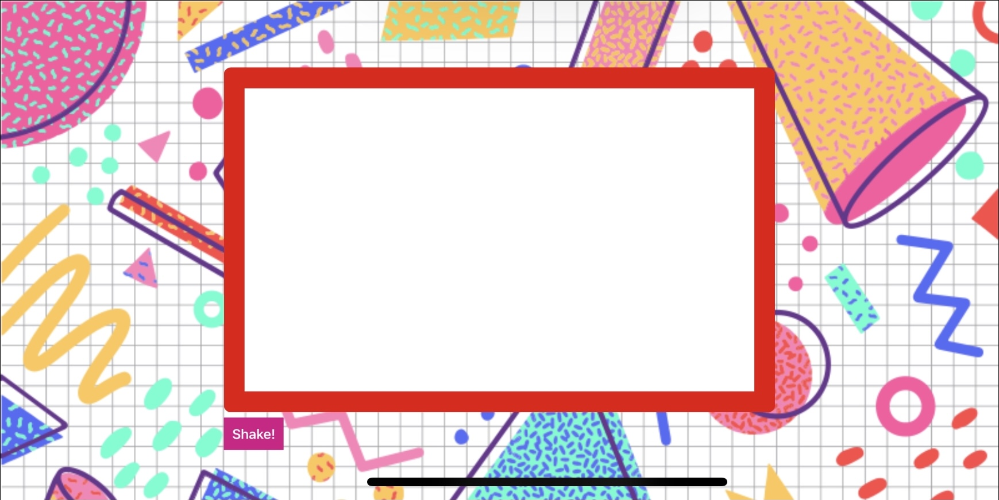

# Etch a Sketch 

*A Completed tutorial via WesBos.com*

## An Etch a Sketch game using vanilla JavaScript

## Live Demo

https://webdevbrum.github.io/Etch-a-Sketch/

## Getting Started 

No pre-requisite installation required.

